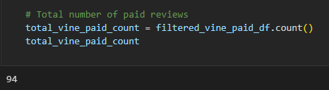
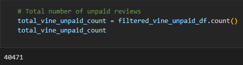
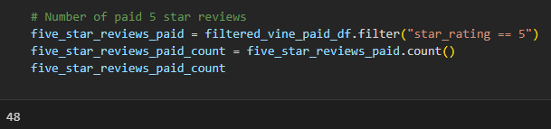
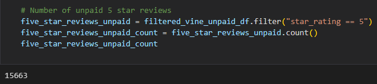
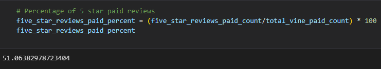
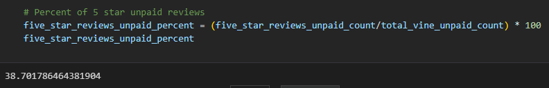

# Amazon Vine Analysis

## Overview of The Analysis

The purpose of this analysis is to analyze Amazon reviews written by members of the paid Amazon Vine Program. From one of the Amazon datasets, I performed the ETL process, transformed the data, connected to and AWS RDS instance, and loaded the data into pgAdmin. Lastly, I used PySpark to determine if there was any bias towards favorable reviews from Vine members in the data set. 

## Results

### Total Number of Vine and non-Vine Reviews:

- Total Number of Vine Reviews: 94

- Total Number of non-Vine Reviews: 40471

### Total Vine & non-Vine Five Star Reviews:

- Total Number of 5-star Vine Reviews: 48

- Total Number of 5-star non-Vine Reviews: 15663

### Percentage of Vine & non-Vine Five Star Reviews:

- Percentage of 5-star Vine Reviews: 51

- Percentage of 5-star non-Vine Reviews: 39

## Summary

Based on the percentage alone, there would seem to be a positivity bias for reviews in the Vine Program (Vine(%51) vs. non-Vine(39)). However, the numbers of reviews is extremely skewed with the number of Vine reviewers being only 94, compared to the 40471 non-Vine reviewers. We could better answer this question as the data set grows and includes more Vine reviews.

